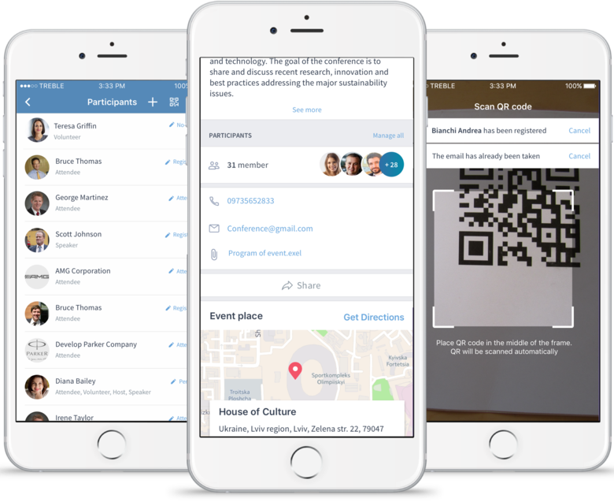

# CiviMobileAPI

The **CiviMobileAPI** extension (`com.agiliway.civimobileapi`) is a CiviCRM component that allows to use a mobile application [CiviMobile](https://civimobile.agiliway.com/).

[CiviMobile](https://civimobile.agiliway.com/) is a native mobile application granting CiviCRM users immediate, secure and high-speed connection to CiviCRM, so that they leverage the combined benefits of the software and their smartphones.

## 

[CiviMobile](https://civimobile.agiliway.com/) Features:

- **Graphical Calendar** - displays all the schedule information in a graphical calendar on the dashboard
- **Profiles** - provides access to the profiles of individual members and organisational branches on the go
- **Search** - allows to find the right contact in the CRM system and dial a person right away
- **Events & Registration** - allows to filter all the available events by type, date or title, register to the chosen event right away, view past and future events, share the information about events and view their locations on the map
- **Cases** - grants immediate access to user’s cases details
- **Activities** - allows to access details of user’s activities, their priority statuses and information about other constituents engaged in them
- **Working Offline** - can work in the offline mode
- **3 locales** - currently, supports 3 locales: English, German and French

The [CiviMobile](https://civimobile.agiliway.com/) application itself can be downloaded from [AppStore](https://itunes.apple.com/us/app/civimobile/id1404824793?mt=8) of [Google Play](https://play.google.com/store/apps/details?id=com.agiliway.civimobile), which should be accessed from the mobile devices of users.

More details about how to start with [CiviMobile](https://civimobile.agiliway.com/) can be found [here](https://civimobile.agiliway.com/#how-to-start).

## Requirements

- PHP v5.4+
- CiviCRM v4.7.x+

## Installation (git/cli)

To install the extension on an existing CiviCRM site:

```
mkdir sites/all/modules/civicrm/ext
cd sites/default/files/civicrm/ext
git clone https://github.com/agiliway/com.agiliway.civimobileapi com.agiliway.civimobileapi
```

1. Install it within the CiviCRM Extensions tab of the administration panel:

- go to Administer -> System Settings -> Extensions
- Click on Install button for CiviMobileAPI extension

2. Clear the cache:

- Administer -> System Settings -> Cleanup Caches and Update Paths

3. Install CiviMobile app into your smartphone from App Store or Google Play Market
4. Open the app on your device and enter the same login information you use for a web version (username and password) and your CiviCRM website URL – a URL you enter to access your CiviCRM system
